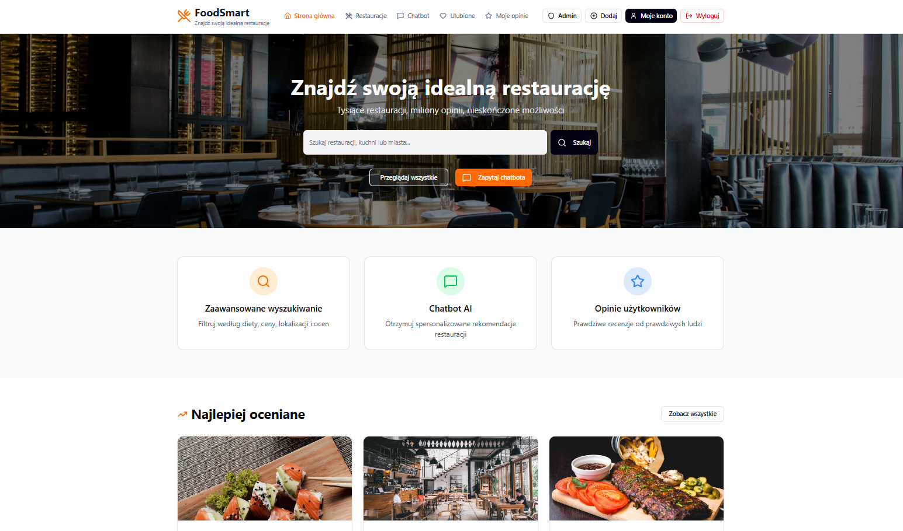
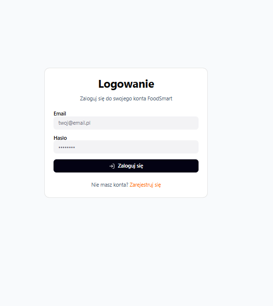
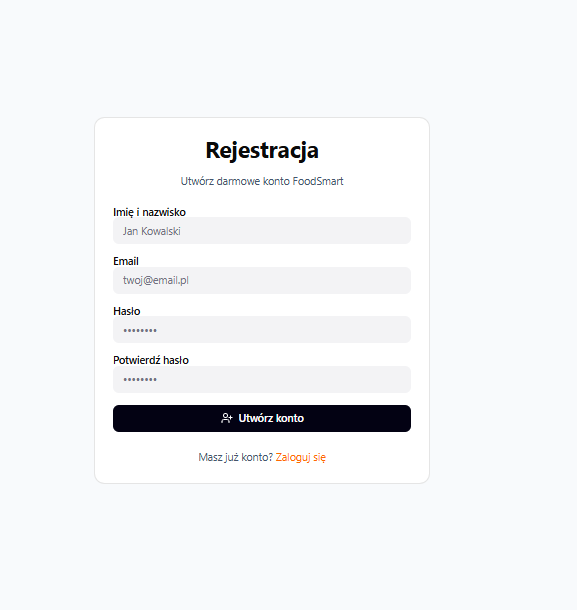
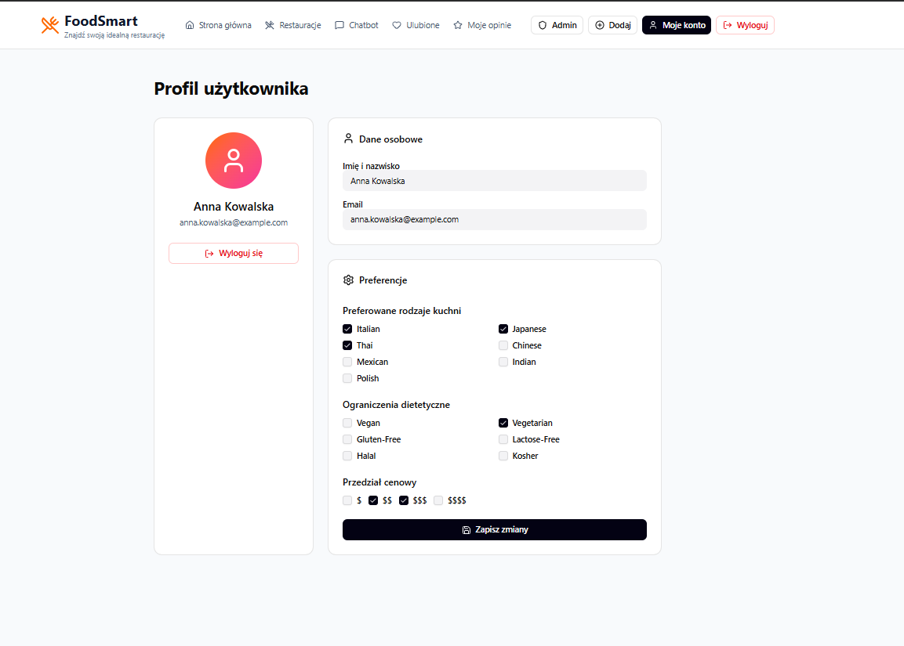
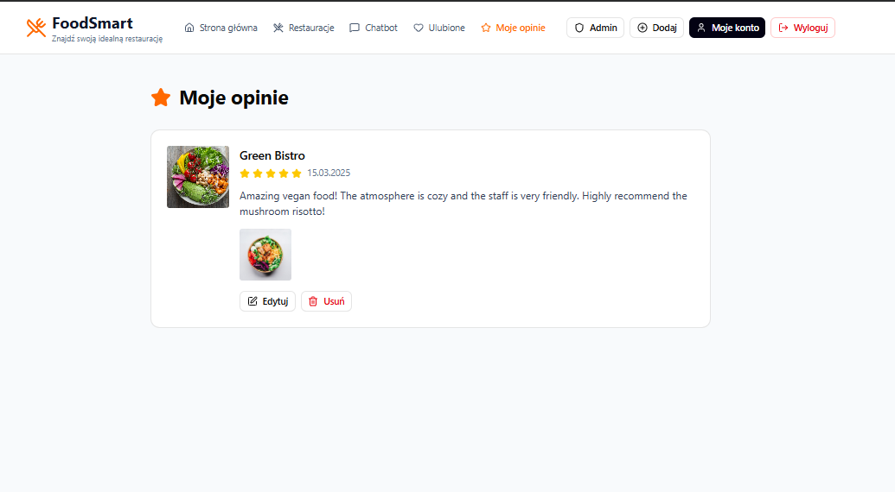
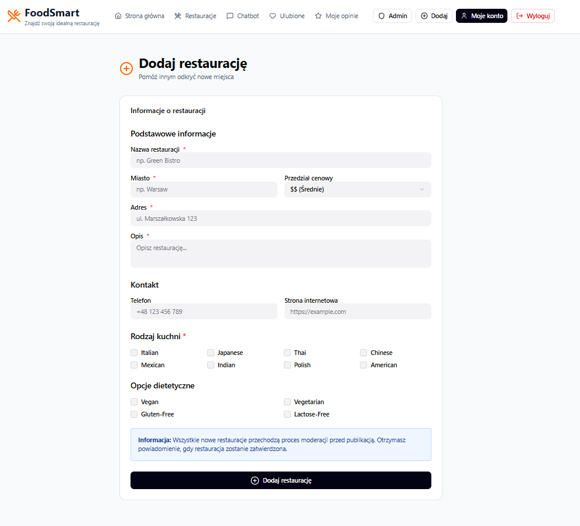
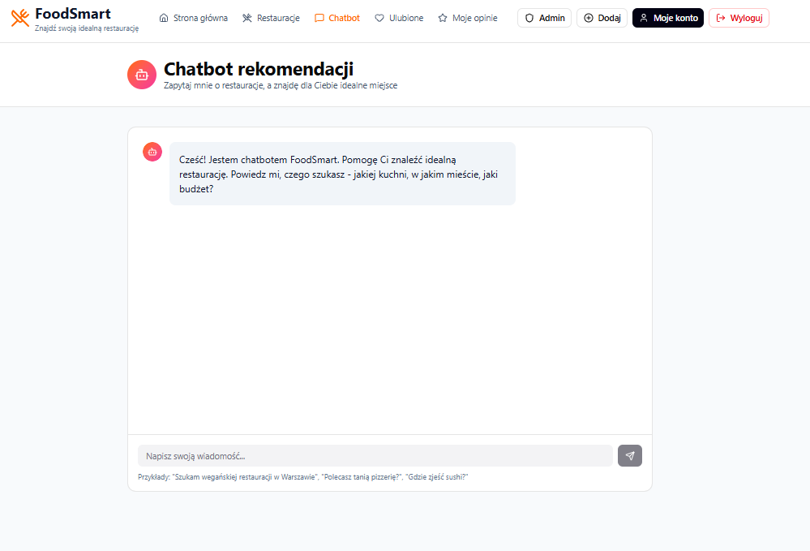
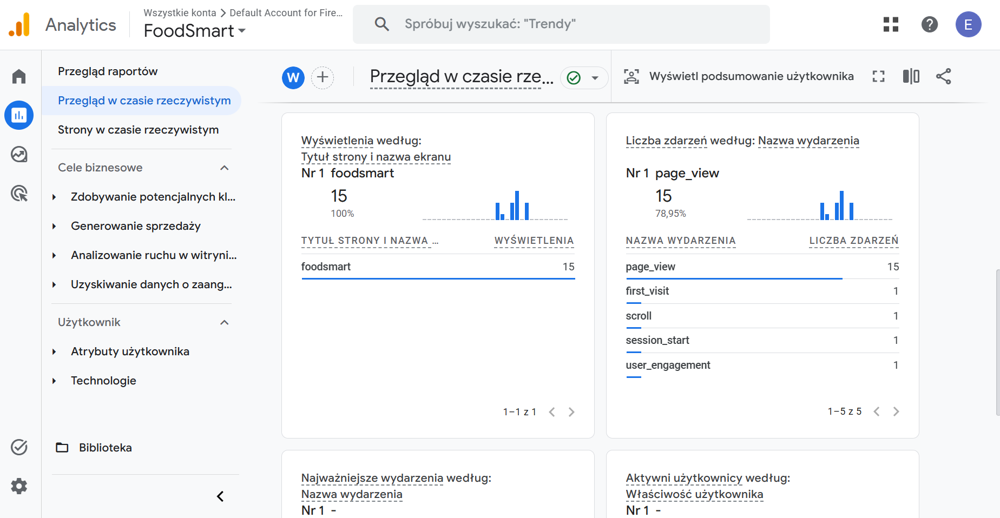
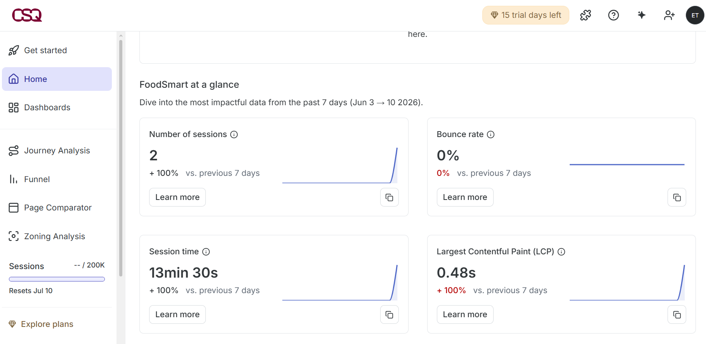
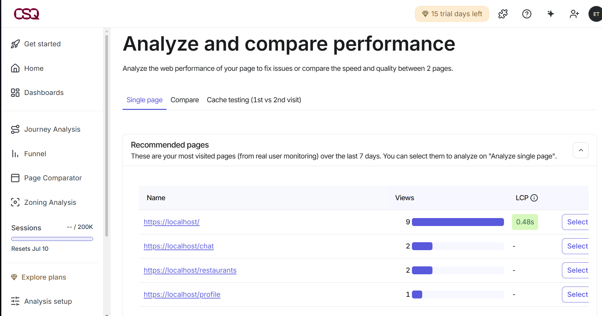

# 🍽️ FoodSmart

## Opis projektu

FoodSmart to aplikacja internetowa stworzona w technologii React i TypeScript, której celem jest wspomaganie użytkowników w wyszukiwaniu restauracji oraz podejmowaniu decyzji dotyczących wyboru lokalu gastronomicznego. Aplikacja umożliwia przeglądanie restauracji, zarządzanie opiniami użytkowników oraz korzystanie z modułu rekomendacji restauracji.

Projekt został wykonany w ramach przedmiotu Techniki Projektowania Frontendowego.

---

## Technologie

Projekt został zrealizowany z wykorzystaniem następujących technologii:

- React 18
- TypeScript
- Vite
- React Router
- Material UI
- Radix UI
- Tailwind CSS
- Lucide React
- Sonner

---

## Funkcjonalności

### Strona główna

Strona główna stanowi centralny punkt aplikacji. Użytkownik może wyszukiwać restauracje, przeglądać najpopularniejsze lokale oraz przechodzić do modułu rekomendacji.



---

### Logowanie użytkownika

Aplikacja umożliwia logowanie użytkowników oraz zarządzanie sesją użytkownika.



---

### Rejestracja użytkownika

Nowi użytkownicy mogą założyć konto za pomocą formularza rejestracyjnego.



---

### Profil użytkownika

Widok profilu umożliwia przeglądanie danych konta oraz informacji związanych z aktywnością użytkownika.



---

### Moje opinie

Użytkownik może przeglądać własne recenzje oraz historię dodanych opinii.



---

### Dodawanie restauracji

System umożliwia dodawanie nowych restauracji za pomocą dedykowanego formularza.



---

### Moduł rekomendacji

Chatbot rekomenduje restauracje na podstawie preferencji użytkownika.




---

## Routing

Aplikacja wykorzystuje React Router do obsługi nawigacji.

| Ścieżka | Opis |
|----------|----------|
| / | Strona główna |
| /login | Logowanie |
| /register | Rejestracja |
| /profile | Profil użytkownika |
| /my-reviews | Moje opinie |
| /add-restaurant | Dodawanie restauracji |
| /chat | Chat rekomendacji |
| /design | Design System |
| /colors | Color System |
| * | Widok 404 |

---

## Struktura projektu

```text
src/
│
├── components/
│   ├── Layout.tsx
│   └── ui/
│
├── pages/
│   ├── Home.tsx
│   ├── Login.tsx
│   ├── Register.tsx
│   ├── Profile.tsx
│   ├── MyReviews.tsx
│   ├── AddRestaurant.tsx
│   ├── ChatRecommendations.tsx
│   ├── DesignSystem.tsx
│   ├── ColorSystem.tsx
│   └── NotFound.tsx
│
├── data/
│   └── mockData.ts
│
├── routes.tsx
├── App.tsx
└── main.tsx
```

---

## Komponenty wielokrotnego użytku

Projekt wykorzystuje zestaw reużywalnych komponentów UI znajdujących się w katalogu `components/ui`.

Przykładowe komponenty:

- Button
- Input
- Card
- Select
- Avatar
- Badge
- Checkbox
- Dropdown Menu
- Textarea

Zastosowanie wspólnych komponentów pozwala zachować spójność wizualną aplikacji oraz ograniczyć duplikację kodu.

---

## Responsywność

Interfejs został zaprojektowany zgodnie z zasadami Responsive Web Design (RWD). Układ automatycznie dostosowuje się do różnych rozdzielczości ekranów, dzięki czemu aplikacja może być wygodnie używana zarówno na komputerach stacjonarnych, jak i urządzeniach mobilnych.

---

## Uruchomienie projektu

Instalacja zależności:

```bash
npm install
```

Uruchomienie środowiska deweloperskiego:

```bash
npm run dev
```

Budowanie wersji produkcyjnej:

```bash
npm run build
```

Podgląd wersji produkcyjnej:

```bash
npm run preview
```

---

## Deploy aplikacji

Link do wdrożonej aplikacji:

```text
https://foodsmart2.vercel.app
```

---

## Firebase Authentication

Aplikacja wykorzystuje Firebase Authentication do obsługi rejestracji i logowania użytkowników.

### Działanie

- **Rejestracja** (`/register`) — tworzy konto w Firebase przy użyciu `createUserWithEmailAndPassword`, następnie zapisuje imię użytkownika przez `updateProfile`
- **Logowanie** (`/login`) — uwierzytelnia użytkownika przez `signInWithEmailAndPassword` z obsługą błędów (nieprawidłowe hasło, brak konta, zbyt wiele prób)
- **Wylogowanie** (`/profile`) — wywołuje `signOut` i czyści lokalną sesję
- **Profil** (`/profile`) — dane zalogowanego użytkownika (imię, email) pobierane są przez `onAuthStateChanged` w czasie rzeczywistym


### Użyte pakiety

- `firebase` — oficjalny SDK Firebase dla JavaScript

---

## Google Analytics

Poniżej przedstawiono konfigurację oraz działanie Google Analytics.



---

## Contentsquare

W aplikacji wykorzystano Contentsquare do monitorowania aktywności użytkowników oraz analizy sposobu korzystania z systemu. Narzędzie umożliwia zbieranie danych o sesjach użytkowników i interakcjach z aplikacją.



